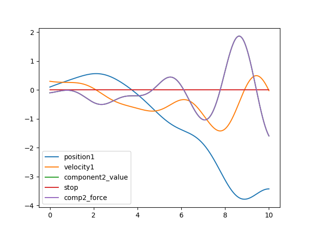

Tutorial 1 - Basics
===================

Let's use npsolve to do some integration through time, like you would to
solve an ODE. Instead of equations, though, we're using class methods.

Imports
-------

Let's start with some imports we'll need.

::

    import numpy as np
    import npsolve
    import matplotlib.pyplot as plt

Setting up variable names
-------------------------

First, setup some variable names for the states that will be integrated. 
These may be floats or 1-dimensional np.ndarrays. Their names must be unique.

::

    # Unique variable names
    COMP1_POS = "position1"
    COMP1_VEL = "velocity1"
    COMP2_VALUE = "component2_value"
    COMP2_FORCE = "comp2_force"

Component classes
-----------------

Now, let's set up some objects to do the calculations. We'll give each
component a `step` method, although we could use any name for the methods.
The first three arguments passed to these methods will be, `state`, `t`, and
`log`.

- **`state`**: A dictionary of the current state for all parameters.
- **`t`**: The time for the curren step.
- **`log`**: Either None, or a dictionary. By setting key-value pairs in this
dictionary for each time step, additional non-state variables can be included
in the results.

::

    class Component1:
        def set_comp2_force(self, force):
            self._comp2_force = force

        def get_pos(self, state):
            return state[COMP1_POS]

        def step(self, state, t, log):
            """Called by the solver at each time step

            Calculate acceleration based on the net component2_value.
            """
            acceleration = self._comp2_force * 1.0
            derivatives = {
                "position1": state[COMP1_VEL],
                "velocity1": acceleration,
            }
            return derivatives
    
    
    class Component2:
        def get_force(self, state):
            return 1.0 * state[COMP2_VALUE]

        def set_comp1_pos(self, pos):
            self._comp1_pos = pos

        def calculate(self, state, t):
            """Some arbitrary calculations based on current time t
            and the position at that time calculated in Component1.
            This returns a derivative for variable 'c'
            """
            dc = 1.0 * np.cos(2 * t) * self._comp1_pos
            derivatives = {COMP2_VALUE: dc}
            return derivatives

        def step(self, state, t, log):
            """Called by the solver at each time step"""
            return self.calculate(state, t)
            

Now, notice that Component1 needs a value called comp2_force, which
Component2 should calculate. This needs to somehow be passed to Component1.
Likewise, Component2 needs to be passed a position from Component1. How can we 
achieve this while still encapsulating the calculations that each component
is responsible for with the component?

Managing interdependencies
--------------------------

It's common to have interdependencies between components. To manage them, 
we'll create another class to inject the interdependencies at the right time
that we'll call `Assembly`.

::

    class Assembly:
        """Handle inter-dependencies."""

        def __init__(self, comp1, comp2):
            self.comp1 = comp1
            self.comp2 = comp2

        def precalcs(self, state, t, log):
            """Inject dependencies for later calculations in 'step' methods."""
            comp1 = self.comp1
            comp2 = self.comp2
            comp1_pos = comp1.get_pos(state)
            comp2_force = comp2.get_force(state)
            if log:
                # Log whatever we want here into a dictionary.
                log[COMP2_FORCE] = comp2_force
            comp1.set_comp2_force(comp2_force)
            comp2.set_comp1_pos(comp1_pos)

Let's have a look at the precalcs method. It accepts `state`, `t`, and `log`,
so it can be called during each time step. It gets values from each component
and then injects them into the other one, so their `step` methods will have
the right values.

Setting up the System
---------------------

Now it's time to link instances of all these components together for use during
integration. For this, we use the `npsolve.System` object. Here, we'll make
a function to create instances of our components, create a System instance,
and add the components to it.

::

    def get_system():
        component1 = Component1()
        component2 = Component2()
        assembly = Assembly(component1, component2)
        system = npsolve.System()
        system.add_component(component1, "comp1", "step")
        system.add_component(component2, "comp2", "step")
        system.add_component(assembly, "assembly", None)
        system.set_stage_calls([("assembly", "precalcs")])
        return system

Let's look at what's going on. The first four lines are simply creating 
instances of the objects. 

Then, we call the `add_component` method. This takes three arguments.

- The component instance itself, an object.
- A unique name for the component.
- The method name on this object to call to get derivatives each time step, 
  or None if no method should be called. The object must have this method.

With the components added, we add a *stage call*. Each stage call happens in
the sequence they are set in the system, prior to any final calls to get
derivatives. We could use the `add_stage_call` method to add a single
call, but it's often easier to set all the stage calls at the same time using
the `set_stage_calls` method. This takes a list of tuples. Each tuple must
contain:

1. The name of the component.
2. The name of the method in that component to call.

If the component does not have the method, it will throw an exception.

Running
-------

Running an integration is now easy. Once we create the system, we:

1. Create an `inits` dictionary of initial values, where each variable name
   is a key with the initial value as the dictoinary value.
2. Setup the system with those initial values using the `setup(inits)` method.
3. Integrate using `npsolve.integrate`.

Here's what it looks like:

::
    
    def run():
        system = get_system()
        inits = {COMP1_POS: 0.1, COMP1_VEL: 0.3, COMP2_VALUE: -0.1}
        system.setup(inits)
        dct = npsolve.integrate(system, t_end=10.0, framerate=60.0)
        return dct

The `npsolve.integrate` method needs the system, an end time, and a framerate.
The framerate only specifies how often outputs are needed; it does not affect
the quality of the integration. The `integrate` method returns a dictionary 
in which each key is a variable name, and each value are the values of that
variable through time. This dictionary also includes a variable for time,
'time', and any logged variables.

Executing and plotting
----------------------

Let's make a function to plot the results using matplotlib, and then two
to run the script.

::

    def plot(dct):
        plt.figure(1)
        dct2 = dct.copy()
        t_vec = dct2.pop("time")
        for var_name, values in dct2.items():
            plt.plot(t_vec, values, label=var_name)
        plt.legend()
        plt.show()

    def execute():
        dct = run()
        plot(dct)

    if __name__ == "__main__":
        execute()

Now let's run it!

Results
-------

We should end up with a plot like this:

Note that the output dictionary also includes a 'stop' flag, which we'll
touch on later.