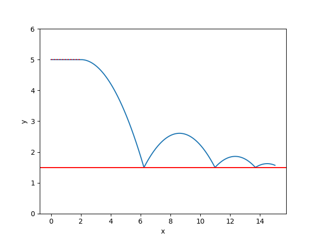
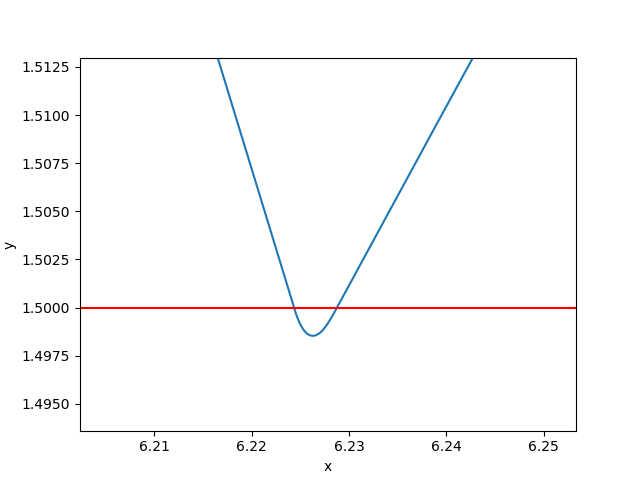

Tutorial 2 - Handling discontinuities
=====================================

Often, real-world integration problems in engineering have discontinuities. 
That means that the physics cannot be described adequately by a single set
of equations. 

Fortunately, *npsolve* provides a `soft_functions` module to make it easy to
handle discontinuities, by preventing them entirely. These functions work
by providing a differential that changes smoothly over a very, very small time,
distance, or whatever value it's applied to. Variable time step solvers, such
many in in *scipy.integrate*, handle these very small but smooth transitions
easily. The approximation of these functions inevitably introduces small
errors, but for many real-world problems these errors are negligible. It's far
more important to get a 99.999% accurate result than none at all.

We'll illustrate the use of two soft_functions to model a bouncing ball. It's
going to start rolling along a ledge, before falling off onto a surface that
it bounces on. Let's start with some setup:

::

    import numpy as np
    from scipy.integrate import odeint
    import matplotlib.pyplot as plt
    
    import npsolve
    from npsolve.soft_functions import negdiff, below
    
    G = -9.80665
    Y_SURFACE = 1.5
    X_LEDGE = 2.0
    Y_LEDGE = 5.0
    
Now we'll start writing our Ball class. We'll give it some mass, an initial
x-velocity, and some parameters to control how it bounces. We'll create the
bouncing by a combination of spring-like behaviour and velocity-dependent
damping. Here's the constructor:

:: 

    class Ball(npsolve.Partial):
        def __init__(self, mass=1.0,
                     k_bounce=1e7,
                     c_bounce=3e3,
                     initial_vel=5.0):
            super().__init__() # Don't forget to call this!
            self.mass = mass
            self.k_bounce = k_bounce
            self.c_bounce = c_bounce
            self.add_var('position', init=np.array([0.0, Y_LEDGE]))
            self.add_var('velocity', init=np.array([initial_vel, 0.0]))

Notice here that the `position` and `velocity` variables are 1D numpy
ndarrays of size 2, to reflect x and y axes. *npsolve* handles variables of 
1D arrays!

Let's create a method in the Ball class to calculate the force of gravity on
the ball.

:: 

    class Ball():
        # ...
        
        def F_gravity(self):
            """ Force of gravity """
            return np.array([0, self.mass * G])
        
Pretty simple so far. Now let's make our ledge react the force of gravity
until the ball reaches the edge of the ledge with another method:

:: 

    class Ball():
        # ...
        
        def F_ledge(self):
            x_pos = self.state['position'][0]
            return -self.F_gravity() * below(x_pos, limit=X_LEDGE)

Here, we're using the `below` soft function. It's 1 below a limit
(here X_LEDGE) and 0 above it, with a very small but smooth transition around
the limit. So, this force will only apply until the ball reaches the edge of
the ledge. We do this so the differentials are continuously smooth, so the
scipy integrator won't have any trouble with discontinuities.

Now, let's make the method to generate a bouncing force when it hits the
surface. This one is a bit more complex:

::
    
    class Ball():
        # ...
        
        def F_bounce(self):
            """ Force bouncing on the surface """
            y_pos = self.state['position'][1]
            y_vel = self.state['velocity'][1]
            F_spring = -self.k_bounce * negdiff(y_pos, limit=Y_SURFACE)
            c_damping = -self.c_bounce * below(y_pos, Y_SURFACE)
            F_damping = c_damping * negdiff(y_vel, limit=0)
            return np.array([0, F_spring + F_damping])

We're using the `negdiff` soft function here. It gives the difference between
a value and some limit when the value is below the limit and 0 when it's above.
Again, it's a smooth function with a very small transition region around the
limit. We apply that to the spring force so it only provides that force 
when the ball is (slightly) below the surface.

For the damping, we've used the `below` function to set up a damping
coefficient, `c_damping`, that will only apply when the ball is (slightly)
below the surface. We also want the damping force to only push the ball - we
don't want it to 'pull' the ball like a sticky surface might. So, we've used
the `negdiff` function on the velocity. When the velocity is positive,
the negdiff function goes to 0 so the damping force will be 0 too. We add
the two forces to return a bounce force.

Now we can set up the `step` method that gets called by the integrator.

::

    class Ball():
        # ...
        
        def step(self, state_dct, t, *args):
            """ Called by the solver at each time step """
            F_net = self.F_gravity() + self.F_ledge() + self.F_bounce()
            acceleration = F_net / self.mass
            derivatives = {'position': self.state['velocity'],
                           'velocity': acceleration}
            return derivatives

This just sums the forces, calculates the acceleration by applying elementary
physics, then returns the acceleration.

Now let's set up the Solver:

::

    class Solver(npsolve.Solver):
        def solve(self):
            self.npsolve_init() # Initialise
            t_vec = np.linspace(0, 3, 100001)
            solution = odeint(self.step, self.npsolve_initial_values, t_vec)
            dct = self.as_dct(solution)
            dct['time'] = t_vec
            return dct
            
This is very much like the solver in the quickstart example. Here though, 
we're using the `as_dct` method to convert the outputs to a dictionary, in
which each key is variable name, and each value is an array of the values
through time.

Let's set up a function to run it and plot the results.

::

    def run():
        solver = Solver()
        partial = Ball()
        solver.connect(partial)
        return solver.solve()
    
    
    def plot(dct):
        plt.plot(dct['position'][:,0], dct['position'][:,1], label='position')
        plt.axhline(Y_SURFACE, c='r')
        plt.plot([0, X_LEDGE], [Y_LEDGE, Y_LEDGE], 'r:')
        plt.ylim(0, 6)
        plt.xlabel('x')
        plt.ylabel('y')
        
Now we can run it!

::

    dct = run()
    plot(dct)
    
We've made a bouncing ball!

If we zoom way in on the bounce, you can see it's actually smooth.

