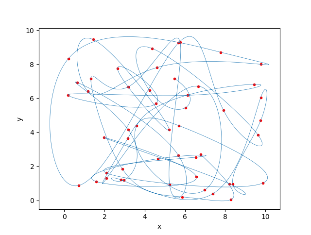
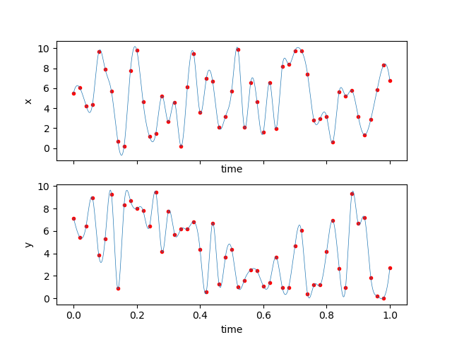

Tutorial 3 - Timeseries input
=============================

We might have inputs we want to use that aren't functions. They might be 
measured timeseries data, for example, such as position over time. Or, they
could be hypothetical data. For this tutorial, we're just use some random
numbers to make a particle move about.

First, the setup:

::

    import numpy as np
    from scipy.integrate import odeint
    import matplotlib.pyplot as plt
    
    import npsolve
    from npsolve.utils import Timeseries
    
    from tutorial_2 import run

Notice, we're going to reuse the Solver and run function we set up in
Tutorial 2, but for a completely different model.

Now let's start to write a Particle class:

:: 

    class Particle(npsolve.Partial):
        def __init__(self):
            super().__init__() # Don't forget to call this!
            self.time_points = np.linspace(0, 1, 51)
            np.random.seed(0)
            self.positions = np.random.rand(51, 2) * 10
            self.xts = Timeseries(self.time_points, self.positions[:,0])
            self.yts = Timeseries(self.time_points, self.positions[:,1])
            self.add_var('position', init=self.positions[0,:])
            
We're creating some timeseries data in the `time_points` and `positions`
attributes. Then, for each x or y axis, we're creating a Timeseries object.
We pass in the x values (the time points) and the values at those times
(positions). The Timeseries class takes care of the rest, and will smoothly
intepolate between those points using a spline. Notice also that
we're setting the initial values of the `position` variable to the 
first pair of (x,y) values in the `positions` array.

Now, let's write the step method.

:: 

    class Particle(npsolve.Partial):
        # ...
    
        def step(self, state_dct, t, *args):
            ''' Called by the solver at each time step 
            Calculate acceleration based on the 
            '''
            velocity = np.array([self.xts(t, der=1), self.yts(t, der=1)])
            derivatives = {'position': velocity}
            return derivatives
            
We're getting the velocity in each axis by simply calling the Timeseries
instances we set up in the constructor. We pass them in the current x value 
(in this case the time), and the derivative we want (der). In this case, 
we want the first derivative of the position, which is time.

We can reuse our run method and Solver from Tutorial 2. We'll set up some
plot functions though:

::

    def plot(dct, particle):
        plt.plot(dct['position'][:,0], dct['position'][:,1], linewidth=0.5)
        plt.scatter(particle.positions[:,0], particle.positions[:,1], c='r',
                    marker='.')
        plt.xlabel('x')
        plt.ylabel('y')
    
    def plot_vs_time(dct, particle):
        fig, axes = plt.subplots(2, 1, sharex=True)
        axes[0].plot(dct['time'], dct['position'][:,0], linewidth=0.5)
        axes[0].scatter(particle.time_points, particle.positions[:,0], c='r',
                    marker='.')
        axes[0].set_xlabel('time')
        axes[0].set_ylabel('x')
        axes[1].plot(dct['time'], dct['position'][:,1], linewidth=0.5)
        axes[1].scatter(particle.time_points, particle.positions[:,1], c='r',
                    marker='.')
        axes[1].set_xlabel('time')
        axes[1].set_ylabel('y')

Now everything's set. Let's run it!

::

    particle = Particle()
    dct = run([particle], t_end=1.0)
    plot(dct, particle)
    plot_vs_time(dct, particle)

Here's how our particle has moved...

And we can see how the Timeseries instances have controlled the velocity, 
and hence position, over time.

    
In real-world models, you'll probably want to use the Timeseries classes 
together with other model equations and logic.

Tip:
    You can make a subclass of a Partial instance and overwrite the step
    method, so that the derivatives are set by Timeseries classes. Then, you
    can easily switch between the original Partial instance and one in which
    one or more derivatives are set by timeseries data!
