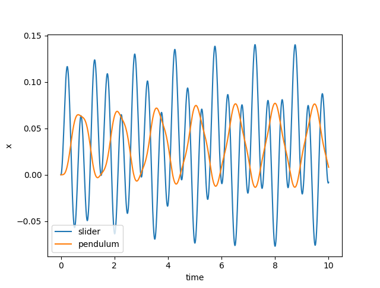
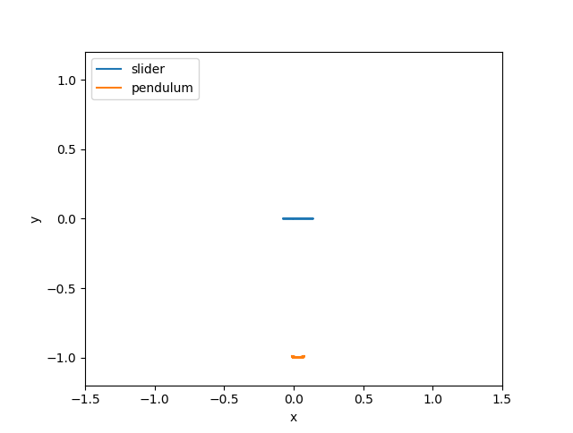
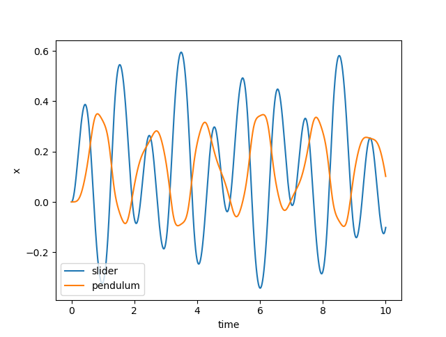
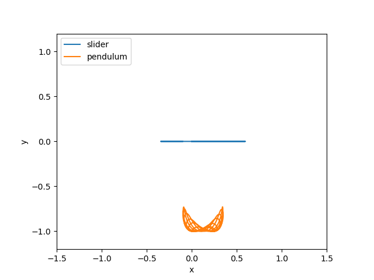
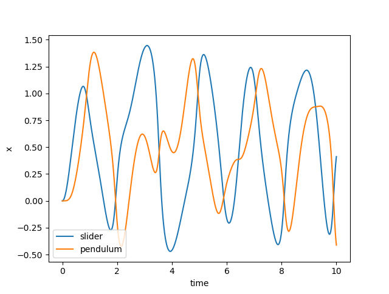
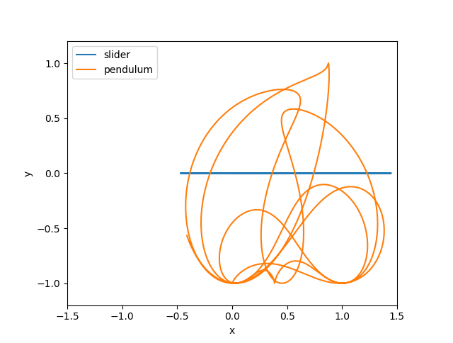

Tutorial 4 - More complex interdependencies
===========================================

In more complex models, values often need to be shared between multiple
components. The approach is exactly the same as in Tutorial 1, we just have
more components and a few more calls to make. 

To illustrate here, we'll simulate the dynamics of a frictionless slider moving in the x axis 
with a pendulum attached that is free to move in the x and y axes. We'll add
a sinusoidal force to the slider to excite the system dynamics.

First, a little setup:

::

    import numpy as np
    from scipy.integrate import odeint
    import matplotlib.pyplot as plt
    import npsolve

    G = np.array([0, -9.80665])

    SPOS = "slider_pos"
    SVEL = "slider_vel"
    PPOS = "pendulum_pos"
    PVEL = "pendulum_vel"

Here, we've made `G` a 2D vector to represent gravity.

SPOS and SVEL relate to slider position and velocity, respectively. These
will be 2-dimensional vectors. PPOS and PVEL relate to pendulum position and
velocity, which will again be 2-dimensional.

The Slider
----------

We'll start defining our Slider class. It's going to have a frequency of
oscilation and a mass.

::

    class Slider:
        def __init__(self, freq=1.0, mass=1.0):
            self.freq = freq
            self.mass = mass

It's going to have a force applied at a pivot point by another object. We'll
call in a tether, although it will take both tensile and compressive loads.
So, we'll set up a method to store the dependency on this value as an 
attribute to use in other methods on.

::

    class Slider:
        # ...
        
        def set_F_tether(self, F_tether):
            self._F_tether = F_tether

The tether will also need to know the position and velocity of the Slider.
Rather than 'reaching in' to get that data from the state dictionary, we'll
provide methods to return the position and velocity.

::

    class Slider:
        # ...
        
        def pos(self, state, t):
            """The location of the tether connection."""
            return state[SPOS]

        def vel(self, state, t):
            """The velocity of the tether connection."""
            return state[SVEL]

We'll also need another method to define the force acting on the Slider at
any given time. Let's define it like this:

::

    class Slider:
        # ...
        
        def F_sinusoid(self, t):
            """The force to make the system do something."""
            return 10 * np.cos(2 * np.pi * (self.freq * t))

Finally, we'll need to define the derivatives of the Slider's position and
velocity. The derivative of the position will be the velocity. The derivative
of velocity is the acceleration, which we can calculate from the force and
mass.

::

    class Slider:
        # ...
        
        def get_derivs(self, state, t, log):
            """Called by the solver at each time step."""
            F_tether = -self._F_tether
            F_tether_x = F_tether[0]
            F_sinusoid_x = self.F_sinusoid(t)
            F_net_x = F_tether_x + F_sinusoid_x
            acc = np.array([F_net_x / self.mass, 0])
            derivatives = {SPOS: state[SVEL], SVEL: acc}
            return derivatives

The Tether
----------

Let's define a Tether class to connect the Slider with the Pendulum mass.

We'll give it three attributes:

::

    class Tether:
        def __init__(self, k=1e6, c=1e4, length=1.0):
            self.k = k
            self.c = c
            self.length = length

It has a spring stiffness, k, a damping coefficient, c, and a length.

It will be useful to provide a method that returns a suitable initial position
for the Pendulum mass. So, let's set one up.

::

    class Tether:
        # ...

        def get_pendulum_init(
            self, slider_pos: np.ndarray[float], force: np.ndarray
        ):
            offset = np.array([0, -self.length])
            stretch = force / self.k
            return slider_pos + offset + stretch

Lastly, we need the Tether to calculate the force it will apply to the 
Slider and Particle.

::

    class Tether:
        # ...

        def F_tether(self, slider_pos, slider_vel, pendulum_pos, pendulum_vel):
            """Work out the force on the pendulum mass"""
            rel_pos = slider_pos - pendulum_pos
            rel_vel = slider_vel - pendulum_vel
            dist = np.linalg.norm(rel_pos)
            unit_vec = rel_pos / dist
            F_spring = self.k * (dist - self.length) * unit_vec
            rel_vel_in_line = np.dot(rel_vel, unit_vec)
            F_damping = self.c * rel_vel_in_line * unit_vec
            return F_spring + F_damping

This method depends on the positions and velocities of the Slider and 
Pendulum mass, and we'll inject these later.

The Pendulum mass
-----------------

Now we'll make the Pendulum class, which has mass as an attribute. As for the
Slider, we'll make methods to set the Tether force, get the position, get the
velocity, and calculate the gravity force.

::

    class Pendulum():
        def __init__(self, mass=1.0):
            self.mass = mass

        def set_F_tether(self, F_tether):
            self._F_tether = F_tether

        def pos(self, state, t):
            """The location of the tether connection."""
            return state[PPOS]

        def vel(self, state, t):
            """The velocity of the tether connection."""
            return state[PVEL]

        def F_gravity(self):
            return self.mass * G
            
Next, we'll add a method to get the derivatives for a given time step.

::

    class Pendulum():
        # ...
    
        def get_derivs(self, state, t, log):
            """Called by the solver at each time step
            Calculate acceleration based on the
            """
            F_net = self._F_tether + self.F_gravity()
            acceleration = F_net / self.mass
            derivatives = {PPOS: state[PVEL], PVEL: acceleration}
            return derivatives

The Assembly class
------------------

Let's make an Assembly class to inject the value dependencies we need.

::

    class Assembly:
        def __init__(self, slider: Slider, pendulum: Pendulum, tether: Tether):
            self._slider = slider
            self._pendulum = pendulum
            self._tether = tether

        def set_tether_forces(self, state, t, log):
            slider = self._slider
            pendulum = self._pendulum
            slider_pos = slider.pos(state, t)
            slider_vel = slider.vel(state, t)
            pendulum_pos = pendulum.pos(state, t)
            pendulum_vel = pendulum.vel(state, t)
            F_tether = self._tether.F_tether(
                slider_pos, slider_vel, pendulum_pos, pendulum_vel
            )
            slider.set_F_tether(F_tether)
            pendulum.set_F_tether(F_tether)

Making the System
-----------------

Now we can create the System like this:

::

    def get_system(freq=1.0):
        slider = Slider(freq=freq)
        pendulum = Pendulum()
        tether = Tether()
        assembly = Assembly(slider, pendulum, tether)
        system = npsolve.System()
        system.add_component(slider, "slider", "get_derivs")
        system.add_component(pendulum, "pendulum", "get_derivs")
        system.add_component(tether, "tether", None)
        system.add_component(assembly, "assembly", None)
        system.add_stage_call("assembly", "set_tether_forces")
        return system

Initial values
--------------

We'll use the `get_pendulum_init` method we made earlier to help us set up
the initial conditions.

::

    def get_inits(system):
        slider_pos = np.zeros(2)
        pend_mass = system["pendulum"].mass
        force = pend_mass * G
        inits = {
            SPOS: slider_pos,
            SVEL: np.zeros(2),
            PPOS: system["tether"].get_pendulum_init(slider_pos, force),
            PVEL: np.zeros(2),
        }
        return inits

Executing and plotting results
------------------------------

We'll set up some functions to run and plot results.

::

    def run(freq=1.0, t_end=1.0, n=100001):
        system = get_system(freq=freq)
        inits = get_inits(system)
        system.setup(inits)
        dct = npsolve.integrate(system, t_end=t_end, framerate=(n - 1) / t_end)
        return dct

    def plot_xs(dct):
        plt.figure()
        plt.plot(dct["time"], dct[SPOS][:, 0], label="slider")
        plt.plot(dct["time"], dct[PPOS][:, 0], label="pendulum")
        plt.xlabel("time")
        plt.ylabel("x")
        plt.legend(loc=3)
        plt.show()

    def plot_trajectories(dct):
        plt.figure()
        plt.plot(dct[SPOS][:, 0], dct[SPOS][:, 1], label="slider")
        plt.plot(dct[PPOS][:, 0], dct[PPOS][:, 1], label="pendulum")
        plt.xlabel("x")
        plt.ylabel("y")
        plt.xlim(-1.5, 1.5)
        plt.ylim(-1.2, 1.2)
        plt.gca().set_aspect("equal")
        plt.legend(loc=2)
        plt.show()

    def plot_distance_check(dct):
        plt.figure()
        diff = dct[PPOS] - dct[SPOS]
        dist = np.linalg.norm(diff, axis=1)
        plt.plot(dct["time"], dist)
        plt.xlabel("time")
        plt.ylabel("length")
        plt.show()

Finally, we'll make a little function to run the model and plot the results.

::

    def execute(freq=1.0):
        # Also try freq=0.7, t_end=60.0, where it bifurcates into chaotic motion.
        dct = run(freq=1.0, t_end=60.0, n=10001)
        plot_xs(dct)
        plot_trajectories(dct)
        plot_distance_check(dct)

    if __name__ == "__main__":
        execute() 

Results
-------

Let's see what happens at 2 Hz:

::

    execute(2.0)
    
    

Nothing very interesting. Both objects just oscillate, as you might expect.
Now let's try at 1 Hz:

::

    execute(1.0)
    

    
The Pendulum is wobbling around a bit more now. Let's try at 0.5 Hz:

::

    execute(1.0)
    

When we look a the trajectories, we see what's really happening...

Remember that our pendulum isn't quite a rigid body - we've approximated it
as a very stiff, highly damped spring. We should check that the approximation 
is good by checking that the distance between the pivot and pendulum is
very very close to 1.0. Let's plot the distance:

:: 

    plot_distance_check(dct)

.. image:: ../../examples/tutorial_4_distance_check.png
    :width: 600

Our maximum length error is only 0.0001, compared to our pendulum length of 
1.0, so we know the errors due to that approximation will be small.