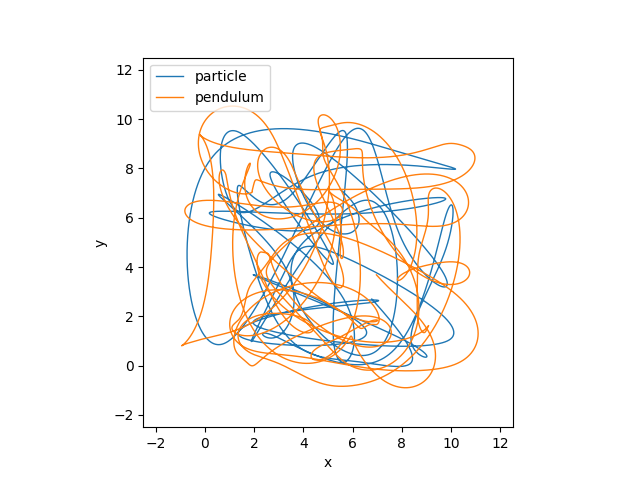

Tutorial 5 - Using polymorphism
===============================

In Tutorial 4, we made a Pendulum move under a Slider. What if that
pendulum moved under the Particle we made in Tutorial 3 instead? Let's find
out, to demonstrate how *npsolve* makes it easy to do so.

We'll start by importing what we need:

::

    import numpy as np
    import matplotlib.pyplot as plt
    from tutorial_2 import run as t2_run
    from tutorial_3 import Particle
    from tutorial_4 import Pendulum
    import fastwire as fw
    wire_box = fw.get_wire_box('demo')

We need to add a `pivot` method to the Particle, so we'll subclass it like 
this.

::

    class Particle2(Particle, fw.Wired):
        
        @wire_box.supply('pivot')
        def pivot(self, t):
            velocity = np.array([self.xts(t, der=1), self.yts(t, der=1)])
            return self.state['position'], velocity
        
That's it - now this class will substitute for the old Slider class! 
We're returning the position and velocity in the same format that the
Pendulum expected from the Slider, and we've wired it to the same 'pivot' wire.

There's one small glitch - initial conditions. In Tutorial 4, we
conveniently set up the initial conditions right. How do we do that now?
Here's how:

::

    def set_init_condition(particle, pendulum):
        init_particle_pos = particle.npsolve_vars['position']['init']
        init_pendulum_pos = init_particle_pos - np.array([0.0, 1.0])
        pendulum.set_init('p_pos', init_pendulum_pos)
    
When a class calls `add_var`, that information gets added to the `npsolve_vars`
attribute. We're taking that, subtracting our pendulum length from the height,
and then calling the `set_init` method to set the initial position of the
pendulum to that position. Easy.

Now we'll make a function to run the new model.

::

    def run(k=1e6, c=1e4):
        particle = Particle2()
        pendulum = Pendulum(k=k, c=c)
        set_init_condition(particle, pendulum)
        partials = [particle, pendulum]
        dct = t2_run(partials, t_end=1.0, n=10001)
        return dct

And a new plot function to see the results.

::

    def plot_trajectories(dct):
        plt.plot(dct['position'][:,0], dct['position'][:,1], linewidth=1.0,
                 label='particle')
        plt.plot(dct['p_pos'][:,0], dct['p_pos'][:,1],  linewidth=1.0,
                 label='pendulum')
        plt.xlabel('x')
        plt.ylabel('y')
        plt.xlim(-2.5, 12.5)
        plt.ylim(-2.5, 12.5)
        plt.gca().set_aspect('equal')
        plt.legend(loc=2)

Let's run it!

::

    dct = run()
    plot_trajectories(dct)
    

    
Our pendulum is now hurtling around with a particle!

Let's check the pendulum length again to ensure it's behaving as expected.

::

    def plot_distance_check(dct):
        diff = dct['p_pos'] - dct['position']
        dist = np.linalg.norm(diff, axis=1)
        plt.plot(dct['time'], dist)
        plt.xlabel('time')
        plt.ylabel('length')
        
    plot_distance_check(dct)
    
.. image:: ../../examples/tutorial_5_distance_check.png
    :width: 600

Here, our stiff spring and firm damping aren't quite enough to handle the
fast accelerations due to the particle motion. So, we'll tweak our 
parameters and run again:

::

    dct = run(k=1e9, c=1e7)
    plot_trajectories(dct)
    plot_distance_check(dct)

Our Pendulum trajectory is different.

.. image:: ../../examples/tutorial_5_distance_check_2.png
    :width: 600

Now, our distance check looks ok, so we can be more confident with this
result - as crazy as it is!

Think about what this lets us do. We might write classes for a given situation. 
Then, say if we run an experiement and get some measured data, we can swap
the relevant Partial for one that uses that Timeseries data. Or, perhaps we 
have a new idea to test - we can easily swap out that part of the model and 
compare it back to back with the first.

We can validate our classes against unittests, theory, and experimental data.
Then, we can run new models that use them without changing anything within
those classes. This can provide confidence that we haven't made any mistakes
within those classes in the new model.
