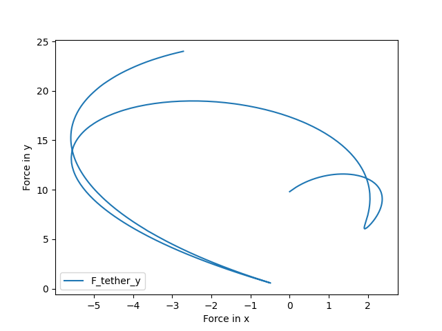
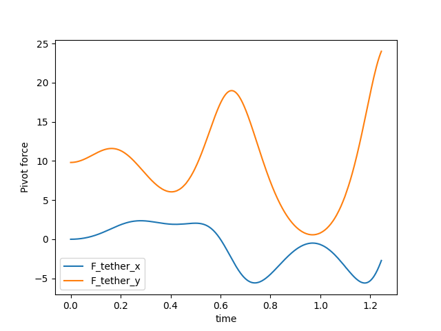
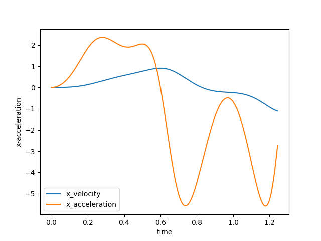

Tutorial 6 - Logging variables and stopping
===========================================

We often want to output non-state values during calculation. We may want to
end the calculation when a condition is met. Fortunately, these are both easy
to do both with *npsolve*.

*npsolve* provides a special `integrate` method to help you do these. 
The integrate method is just a wrapper around npsolve's ODEIntegrator class.
By default, it uses the LSODA integrator in *scipy* (if *scipy* is present).
However, it's built to use any set of integrators that work like *scipy*'s
`ode`. It works by breaking up the time domain into short frames. It uses
the integrator to integrate between each frame as normal. *scipy*'s ode
integrators are stateful, so they can continue with the next frame with
minimal overhead.

At each frame, the Integrator class calls the step method in the System with
a dictionary the `log` attribute. It's designed to store any numeric data
with strings for keys. The state variables and their values are logged
by default, so you don't need to add them.

The log dictionary also contains a special key called `stop` 
that has a boolean value. It's normally False. Set it to True somewhere,
and it will stop the solver after the current frame.

Here's an example. Let's change the step method of the Pendulum class in
Tutorial 4 to add some logging and raise a stop flag. We'll first do some
imports:
    
::
    
    import matplotlib.pyplot as plt
    import npsolve
    from tutorial_4 import Slider, Pendulum, Tether, Assembly, PPOS, PVEL
    from tutorial_4 import get_inits

    from npsolve.solvers import STOP

Let's modify the Pendulum2 to add some logged parameters and change the
stop flag if the force in the y-axis exceeds 24.0.

::
    
    class Pendulum2(Pendulum):
        def get_derivs(self, state, t, log):
            """Called by the solver at each time step
            Calculate acceleration based on the
            """
            F_net = self._F_tether + self.F_gravity()
            acceleration = F_net / self.mass
            if log:
                log["F_tether"] = self._F_tether
                log["acceleration"] = acceleration
                if self._F_tether[1] > 24.0:
                    log[STOP] = True
            derivatives = {PPOS: state[PVEL], PVEL: acceleration}
            return derivatives

We'll modify our `get_system` method to use this class.

::
    
    def get_system():
        slider = Slider()
        pendulum = Pendulum2()
        tether = Tether()
        assembly = Assembly(slider, pendulum, tether)
        system = npsolve.System()
        system.add_component(slider, "slider", "get_derivs")
        system.add_component(pendulum, "pendulum", "get_derivs")
        system.add_component(tether, "tether", None)
        system.add_component(assembly, "assembly", None)
        system.add_stage_call("assembly", "set_tether_forces")
        return system
        
Now, as usual, we'll add a few functions to run and plot.

::
    
    def run(t_end=20.0, n=100001):
        system = get_system()
        inits = get_inits(system)
        system.setup(inits)
        dct = npsolve.integrate(system, t_end=t_end, framerate=(n - 1) / t_end)
        return dct

    def plot_pivot_force(dct):
        plt.figure()
        plt.plot(dct["F_tether"][:, 0], dct["F_tether"][:, 1], label="F_tether_y")
        plt.xlabel("Force in x")
        plt.ylabel("Force in y")
        plt.legend(loc=3)
        plt.show()

    def plot_F_tether_vs_time(dct):
        plt.figure()
        plt.plot(dct["time"], dct["F_tether"][:, 0], label="F_tether_x")
        plt.plot(dct["time"], dct["F_tether"][:, 1], label="F_tether_y")
        plt.xlabel("time")
        plt.ylabel("Pivot force")
        plt.legend(loc=3)
        plt.show()

    def plot_acc(dct):
        plt.figure()
        plt.plot(dct["time"], dct[PVEL][:, 0], label="x_velocity")
        plt.plot(dct["time"], dct["acceleration"][:, 0], label="x_acceleration")
        plt.xlabel("time")
        plt.ylabel("x-acceleration")
        plt.legend(loc=3)
        plt.show()

    def execute():
        dct = run(t_end=20.0, n=10001)
        plot_pivot_force(dct)
        plot_F_tether_vs_time(dct)
        plot_acc(dct)

    if __name__ == "__main__":
        execute()

Results
-------
    
Now, the variables we logged are in the output dictionary, and it's stopped
when our stop condition was met.

    

It's as easy as that.
