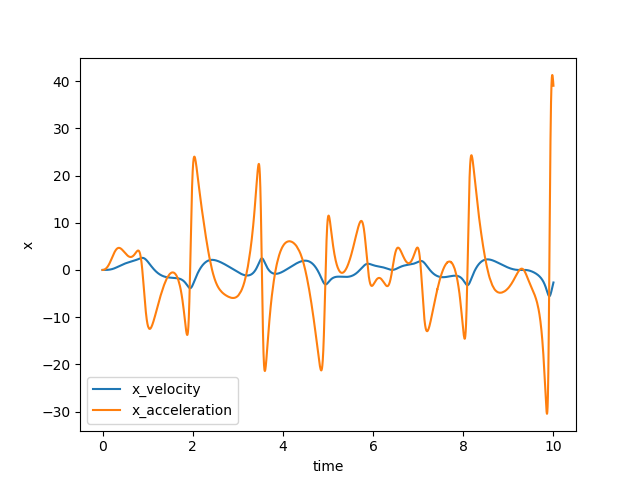
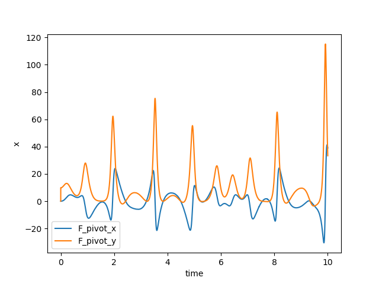

Tutorial 6 - Logging variables and stopping
===========================================

We often want to output non-state values during calculation. We may want to
end the calculation when a condition is met. Fortunately, these are both easy
to do both with *npsolve*.

*npsolve* provides a special Integrator class to help you do these. By 
default, it uses the LSODA integrator in *scipy* (if *scipy* is present).
However, it's built to use any set of integrators that work like *scipy*'s
`ode`. It works by breaking up the time domain into short frames. It uses
the integrator to integrate between each frame as normal. *scipy*'s integrators
are stateful, so they can continue with the next frame with minimal overhead.

At each frame, the Integrator class sets a special `status` flag, which can
be anywhere else in the code. When this flag (npsolve.solvers.Final) is set,
it means the state values for that time are the 'final' (not guesses by the
variable-time-step solver). Partial classes can then add values to be logged.
The solver also listens to a flag to stop the integration at that point that
can be set from anywhere else in the code.

Here's an example. Let's change the step method of the Pendulum class in
Tutorial 4 to add some logging and raise a stop flag. We'll first do some
imports:
    
::
    
    import matplotlib.pyplot as plt
    import npsolve
    from tutorial_4 import Slider, Pendulum

Now let's set up our status dictionary and our logger.

::
    
    from npsolve.solvers import FINAL, STOP
    status = npsolve.get_status('demos_status')
    logger = npsolve.get_logger('demos_logger')

We'll use the FINAL and STOP flags with the status dictionary.

Now let's modify the stop method of the Pendulum class so it looks like this:
    
::
    
    class Pendulum2(Pendulum):
        def step(self, state_dct, t, *args):
            ''' Called by the solver at each time step 
            Calculate acceleration based on the 
            '''
            F_pivot = self.F_pivot(t)
            F_gravity = self.F_gravity()
            F_net = F_pivot + F_gravity
            acceleration = F_net / self.mass
            if status[FINAL]:
                logger['F_pivot'].append(F_pivot)
                logger['acceleration'].append(acceleration)
            if F_pivot[1] > 90.0:
                status[STOP] = True
            derivatives = {'p_pos': state_dct['p_vel'],
                           'p_vel': acceleration}
            return derivatives
        
We've added some logging under `if status[FINAL]:` and raised a stop flag
under `if F_pivot[1] > 90.0:`.

We'll use the Integrator class to solve this, since it knows how to use
those flags. We'll write a new run method to use it.

::
    
    def run(partials, t_end=20.0, n=100001):
        solver = npsolve.solvers.Integrator(status=status,
                                            logger=logger,
                                            framerate=n//t_end)
        solver.connect(partials)
        return solver.run(t_end)

Now some plotting functions:
    
::
    
    def plot_F_pivot(dct):
        plt.figure()
        plt.plot(dct['time'], dct['F_pivot'][:,0], label='F_pivot_x')
        plt.plot(dct['time'], dct['F_pivot'][:,1], label='F_pivot_y')
        plt.xlabel('time')
        plt.ylabel('x')
        plt.legend(loc=3)
    
    def plot_acc(dct):
        plt.figure()
        plt.plot(dct['time'], dct['p_vel'][:,0], label='x_velocity')
        plt.plot(dct['time'], dct['acceleration'][:,0], label='x_acceleration')
        plt.xlabel('time')
        plt.ylabel('x')
        plt.legend(loc=3)

Finally, we'll execute the new code:
    
::
    
    def execute(freq):
        partials = [Slider(freq=freq), Pendulum2()]
        dct = run(partials, t_end=20.0, n=10001)
        plot_F_pivot(dct)
        plot_acc(dct)

    execute(freq=0.5)
    

   

It's as easy as that. Notice first that the integrator has stopped early
because the Pendulum2 instance raised a `status[STOP] = True` flag.

Our logged outputs are now in the output dictionary along with our state
variables, which makes it easy to work with them. The logging
is controlled by the Partial instances, and we don't have to change anything
else in our code. As a bonus, the Pendulum2 class will still work as normal
with the original solver in Tutorial 2 - the logging and stopping just won't
work with it because that solver doesn't use them.

Note:
    Be sure that logged variables are logged only *once* per time step, since
    otherwise the outputs won't match up right. In tricky situations, you can
    use the `@npsolve.mono_cached()` decorator to do that, since it will 
    only execute the code inside the function once per time step.

